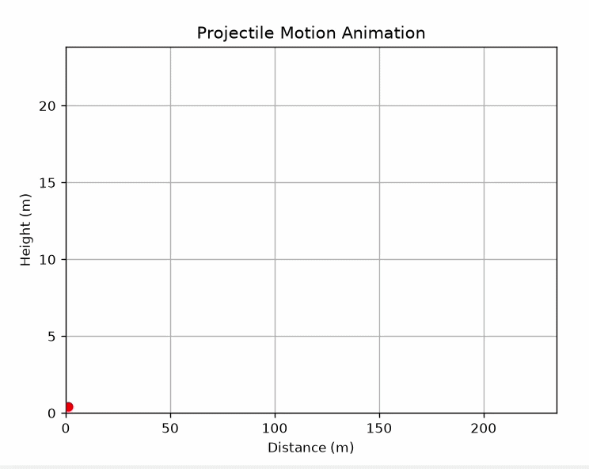

# Projectile Motion Animation

A beginner computational physics project that visualizes projectile motion using Python and Matplotlib.

## Overview

This project explores the physics of projectile motion through progressively improved simulations and visualizations.

It was created as part of my journey into:

- Computational Physics
- Scientific Programming
- Python
- Git and GitHub
- Physics Simulations

## Technologies Used

- Python
- NumPy
- Matplotlib
- VS Code
- GitHub

## Versions

### v1.py
Basic projectile trajectory plotted using projectile motion equations.

### v2.py
User-defined launch velocity and launch angle for interactive trajectory generation.

### v3.py *(planned)*
Animated projectile motion visualization.

## Physics Concepts

- Projectile Motion
- Kinematics
- Velocity Components
- Gravity
- Trajectory Analysis

# Projectile Motion Animation

## Purpose

The goal of this project is to use computational tools and visualization techniques to better understand physical systems and build practical scientific programming skills.

## Future Improvements

- Animated projectile motion
- Multiple trajectory comparison
- Air resistance effects
- Interactive controls and sliders
- Trajectory statistics (range, maximum height, time of flight)

## Author

**Rutuparna Nayak**

GitHub: https://github.com/rutuparna-phy
